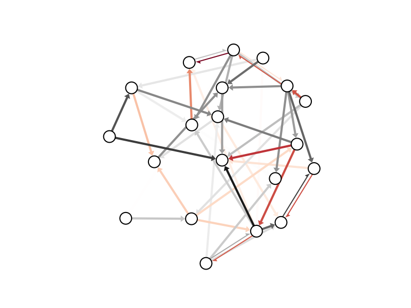
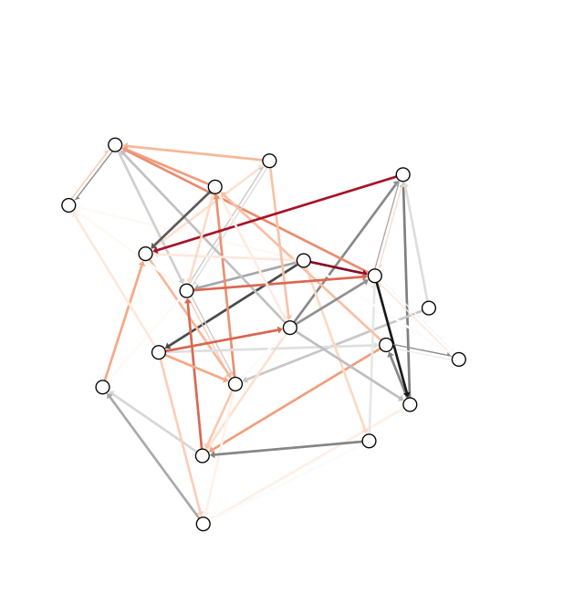
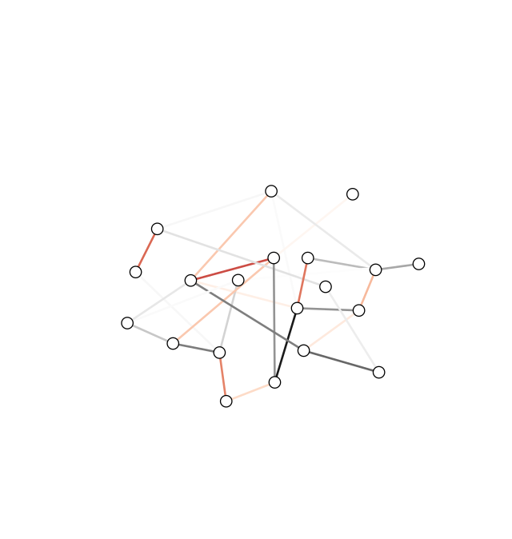
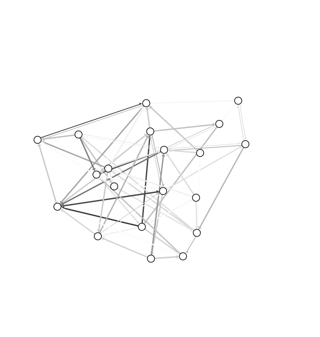
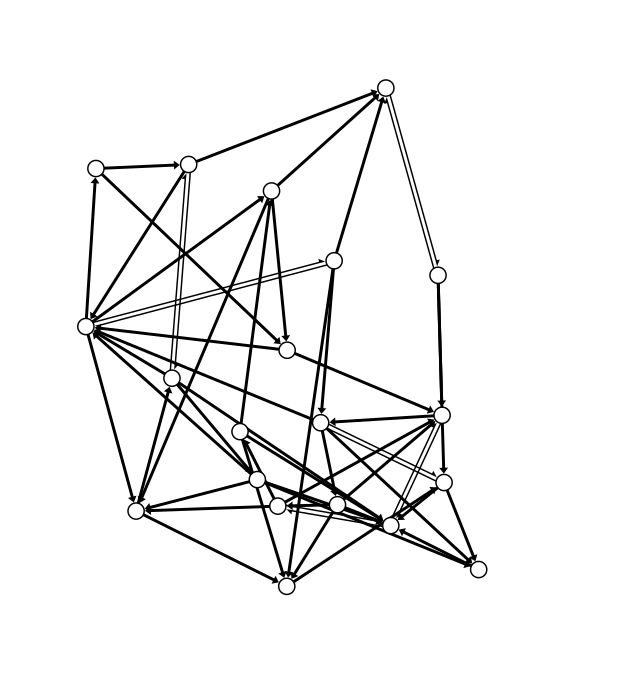
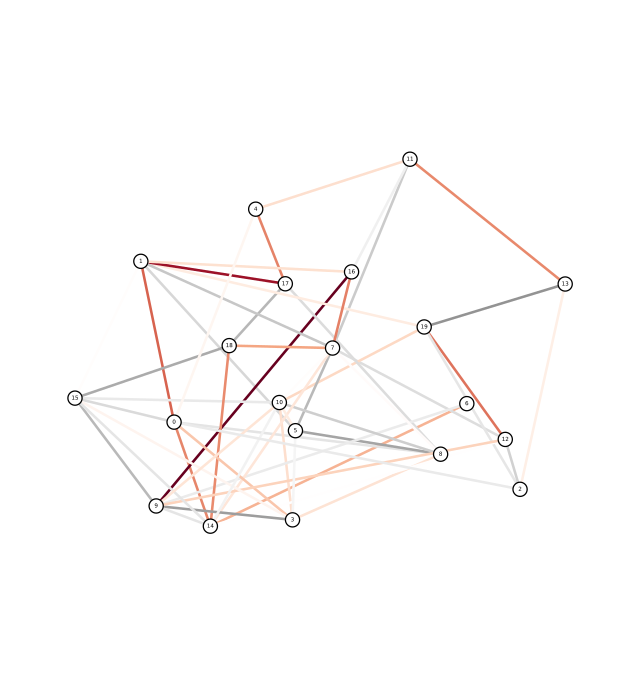
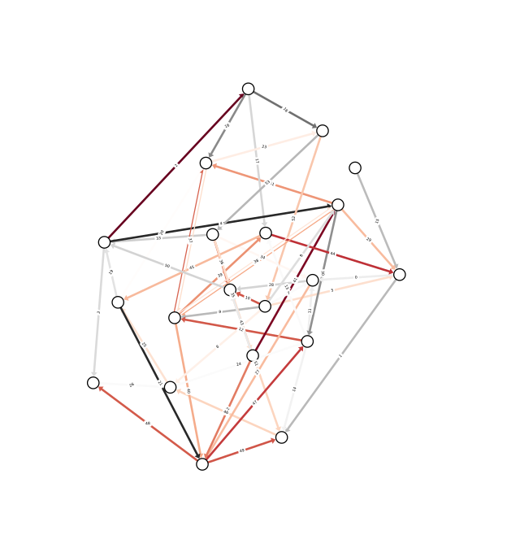

# netgraph
Fork of networkx drawing utilities for publication quality plots of networks

## Summary:

Module to plot weighted, directed graphs of medium size (10-100 nodes).
Unweighted, undirected graphs will look perfectly fine, too, but this module
might be overkill for such a use case.

## Raison d'etre:

Existing draw routines for networks/graphs in python use fundamentally different
length units for different plot elements. This makes it hard to
    - provide a consistent layout for different axis / figure dimensions, and
    - judge the relative sizes of elements a priori.
This module amends these issues. 

Furthermore, this module allows to tweak node positions using the
mouse after an initial draw.

## Installation

Easiest via pip.

```
pip install netgraph
```

For the newest and brightest (and probably buggiest) version:

```
pip install git+https://github.com/paulbrodersen/netgraph.git
```

## Examples:

```python
import numpy as np
import matplotlib.pyplot as plt; plt.ion()
import netgraph

# construct sparse, directed, weighted graph
# with positive and negative edges
n = 20
w = np.random.randn(n,n)
p = 0.2
c = np.random.rand(n,n) <= p
w[~c] = np.nan

# plot
netgraph.draw(w)
```



`netgraph.draw` supports various formats for the `graph` argument (`w` in the example above).

In order of precedence:

1. Edge list:

   Iterable of (source, target) or (source, target, weight) tuples,
   or equivalent (m, 2) or (m, 3) ndarray.
   
2. Adjacency matrix:

   Full-rank (n,n) ndarray, where n corresponds to the number of nodes.
   The absence of a connection is indicated by a zero.
   
3. igraph.Graph or networkx.Graph object

```python
import networkx
g = networkx.from_numpy_array(w, networkx.DiGraph)
netgraph.draw(g)
```

There are many ways to customize the layout of your graph. For a full
list of available arguments, please refer to the documentation of
- `draw` 
- `draw_nodes`
- `draw_edges`
- `draw_node_labels`
- `draw_edge_labels`

## Interactive plotting

If no node positions are explicitly provided (via the `node_positions` argument to `draw`),
netgraph uses a spring layout to position nodes (Fruchtermann-Reingold algorithm).
If you would like to manually tweak the node positions using the mouse after the initial draw,
use the InteractiveGraph class:

```python
graph = netgraph.InteractiveGraph(w)
```


The new node positions can afterwards be retrieved via:

```python
pos = graph.node_positions
```

**You must retain a reference to the InteractiveGraph
instance at all times** (i.e. `graph` in the example above). Otherwise,
the object will be garbage collected and you won't be able to alter
the node positions interactively.

## Gallery

The following images show the netgraph output when using the default
settings, i.e. the output of `draw` in the absence of any arguments
other than `graph`.

Default plot for a directed, weighted network:


No arrows are drawn if the network appears undirected:


Edge weights are mapped to edge colors using a diverging colormap, by default 'RdGy'.
Negative weights are shown in red, positve weights are shown in gray.
A directed network with purely positive weights hence looks like this:


Unweighted networks are drawn with uniformly black edges:


Labels can be drawn on top of nodes.


Labels can be drawn on top of edges:



